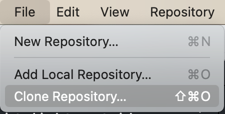
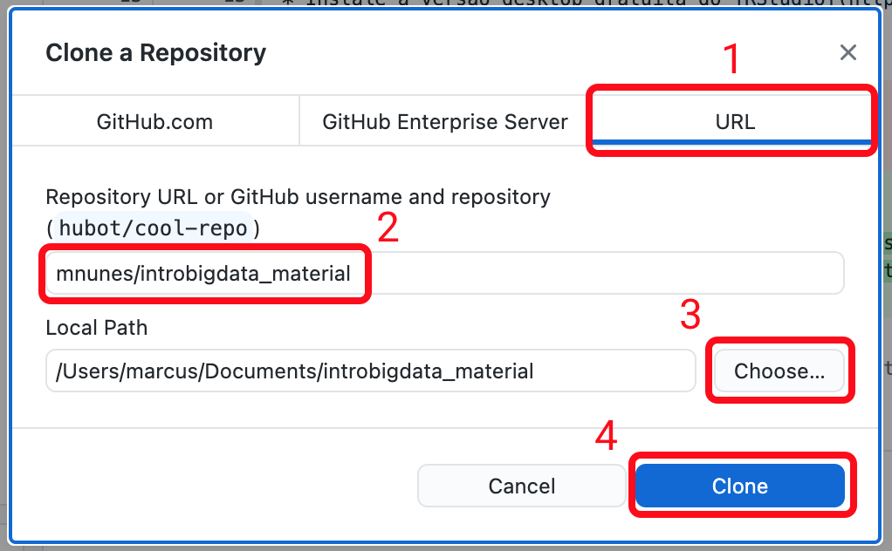
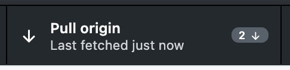

# Introdução

Bem-vindo ao site da disciplina [EST0133 - Introdução à Modelagem de Big Data](https://introbigdata.org/), ministrada aos alunos do [Bacharelado em Estatística da UFRN](https://sigaa.ufrn.br/sigaa/public/departamento/portal.jsf?id=47). O material contido aqui está sendo utilizado durante o semestre 2020.2. Atualmente não é possível aceitar alunos de fora da universidade nesse curso, mas o material está aberto a quem quiser utilizá-lo.

Além dos slides, exercícios e códigos disponibilizados nesse repositório, há uma [playlist no YouTube](https://www.youtube.com/watch?v=_WPwzO5nt0c&list=PLr1K6DyuZsE7e36K7ljToOTpMH1bKyFtJ) com vídeos explicativos sobre cada tópico.

Este é um projeto de [Marcus Nunes](https://marcusnunes.me/).

# Primeiros Passos

Há alguns programas que devem ser instalados em seu computador para que ele fique preparado para acompanhar as aulas. A lista destes programas está a segu. Eles devem ser instalados na ordem em que estão colocados abaixo.

1. Instale o interpretador da linguagem de programação [R](https://www.r-project.org/). A versão 4.2.1 é a mais recente neste momento. Recomendo **fortemente** que, caso o `R` já esteja instalado em seu computador, ele seja atualizado para a versão mais atual.

2. Instale a versão desktop gratuita do [RStudio](https://rstudio.com/products/rstudio/download/).

3. Caso seu computador rode Windows, é necessário instalar um programa extra para compilar os arquivos-fonte de alguns dos pacotes utilizados. Esse programa é chamado [RTools](https://cran.r-project.org/bin/windows/Rtools/), é gratuito e pode ser baixado [nesse link](https://cran.r-project.org/bin/windows/Rtools/). Atente para baixar a versão do RTools equivalente à da sua versão do R. 

4. Há uma série de pacotes a serem instalados no `R` para que a disciplina seja acompanhada. Assim, após abrir o RStudio pela primeira vez, rode o comando abaixo para que todos os pacotes necessários sejam instalados em seu computador. O script irá verificar quais pacotes necessários para a disciplina já estão em seu computador e apenas aqueles pacotes que estiverem faltando serão baixados e instalados. Além disso, o script irá atualizar os pacotes que estiverem em versões antigas. É um comando demorado a ser executado, cuja duração dependerá da velocidade da sua conexão à internet.

`source("https://raw.githubusercontent.com/mnunes/introbigdata_material/master/scripts/pacotes.R")` 

5. É possível baixar os slides e códigos da disciplina manualmente. Entretanto, a melhor maneira de se manter a par com o que está ocorrendo é através do git. Crie uma conta no [github](https://github.com/) e instale o [GitHub Desktop](https://desktop.github.com/) para facilitar a sua vida. Todas essas ferramentas são gratuitas.

6. Com o GitHub Desktop instalado, é necessário **clonar** esse repositório em seu computador. Basta seguir dois passos para isso. O primeiro deles é ir ao menu File > Clone Repository... 

7. Em seguida, siga os passos abaixo, na ordem em que estão colocados:
  
  - 1. Clique no campo URL.
  - 2. Entre com o endereço deste repositório: `mnunes/introbigdata_material`.
  - 3. Escolha uma pasta em seu computador para salvar os arquivos. Eu sugiro que seja na mesma pasta em que estão os materiais de suas outras disciplinas na universidade.
  - 4. Clique no botão **Clone** para copiar os arquivos para o seu computador.

8. Sempre que for necessário atualizar o material, clique no botão **Fetch origin**, localizado na barra superior da tela. 

9. Se houver uma ou mais atualizações a serem baixadas, clique na mensagem **Pull origin**, que aparecerá no mesmo botão.

10. Entre regularmente no Github Desktop para realizar as operações **Fetch origin** e  **Pull origin** para, assim, manter-se atualizado com a disciplina. Eventuais _typos_ nos slides e nos códigos serão corrigidos dessa maneira.

11. Bugs nos códigos, erros de digitação nos slides, conjuntos de dados faltantes e demais erros ou problemas com o material podem ser facilmente reportados [nesse link](https://github.com/mnunes/introbigdata_material/issues). Usuários que conheçam melhor o funcionamento do github podem submeter _pull requests_.

# Referências Bibliográficas

O material da disciplina foi produzido a partir de várias referências espalhadas por bibliotecas e pela internet. Poucas delas estão em português.

## Livros

* Hastie, T. e Tibshirani, R. (2009). _The Elements of Statistical Learning: Data Mining, Inference, and Prediction_. Springer. [link](https://web.stanford.edu/~hastie/Papers/ESLII.pdf)
* Izbicki, R. e dos Santos, T. M. (2020) _Aprendizado de máquina: uma abordagem estatística_. São Carlos. [link](http://www.rizbicki.ufscar.br/AME.pdf)
* James, G., Witten, D., Hastie, T., e Tibshirani, R. (2014). _An Introduction to Statistical Learning with Applications in R_. Springer.
* Kuhn, M. e Johnson, K. (2013). _Applied Predictive Modeling_. Springer. [site do livro, sem seu conteúdo completo](http://appliedpredictivemodeling.com/)
* Kuhn, M. e Johnson, K. (2019). _Feature Engineering and Selection: A Practical Approach for Predictive Models._ Taylor & Francis. [link](https://bookdown.org/max/FES/)
* Lantz, B. (2013). _Machine Learning with R_. Packt Publishing.
* Tan, P.-K., Steinbach, M., e Kumar, V. (2012). _Introdução ao Data Mining: Mineração de Dados_. Ciência Moderna.
* Zhao, Y. (2012). _R and Data Mining: Examples and Case Studies_. Academic Press.

## Sites

* [Tidyverse](https://www.tidyverse.org/)
* [Tidymodels](https://www.tidymodels.org/)
* [DS-Zero](https://github.com/leobezerra/ds-zero)

## Leituras complementares

* Domingos, P. (2015). _The Master Algorithm: How the Quest for the Ultimate Learning Machine Will Remake Our World_. Basic Books.
* O'Neil, C. (2017) _Weapons of Math Destruction: How Big Data Increases Inequality and Threatens Democracy_. Crown.
* O'Neil, C. e Schutt, R. (2013) _Doing Data Science: Straight Talk from the Frontline_. O'Reilly.
* Parker, M. (2020). _Humble Pi: A Comedy of Maths Errors_. Penguin.

